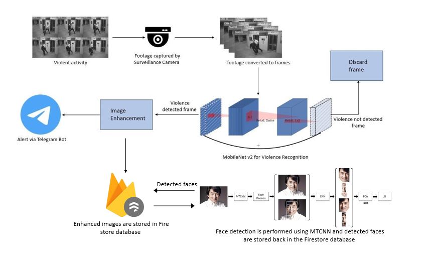
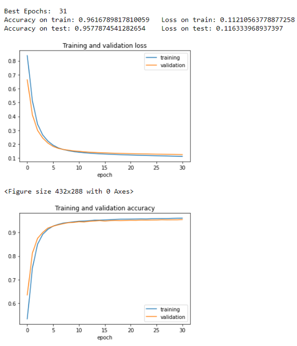
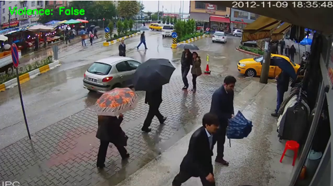

# Violence_Detection_System_using_DeepLearning

## Introduction

Violent behavior in public places poses significant challenges to communities worldwide. It undermines productivity, decreases property values, and disrupts social services, making it a critical public health and safety issue. Real-time detection of violence from surveillance videos is essential to promptly alert authorities and prevent incidents from escalating.

Recent advancements in deep learning, particularly using models like MobileNetv2, have shown promise in automatically detecting violent scenes in video footage. This project focuses on implementing a real-time violence alert system using MobileNetv2. The system enhances output frames for clarity, incorporates time and location details, and sends alerts to nearby police stations via a Telegram bot.

## Problem Statement
Despite the widespread use of CCTV surveillance, it lacks the capability to automatically detect violent behavior. Manually monitoring surveillance footage is impractical, and the time it
takes to respond to violent incidents is critical. Therefore, there’s a need for a Real-Time violence alert system to swiftly identify and notify authorities about violent activities as they occur.

## Objectives

1. Address the issue of violence in public places and its detrimental effects on communities.
2. Develop a reliable real-time violence detection system capable of promptly alerting authorities.
3. Automate the detection of violent scenes in surveillance videos to eliminate the need for manual monitoring.
4. Enhance output frames from the MobileNetv2 model and integrate time and location details into alert notifications.
5. Implement an alert system that notifies nearby police stations via Telegram for timely intervention.

## Methodology/ Implementation Plan

The system involves two primary actors: individuals engaged in violent activities and nearby police stations. Key use cases include human detection, frame extraction, violence detection using MobileNetv2, image enhancement, and alert notifications to police stations.

### System Architecture

#### Data Collection

- Utilizes a dataset of 1000 video clips categorized into violence and non-violence classes.

#### MobileNetv2

- Implements a deep learning model for violence detection, leveraging depth-wise separable convolutions for efficiency.

#### Image Enhancement

- Improves the quality of output frames using the Python Imaging Library (PIL).

#### Alert Module

- Sends alert messages via Telegram bot to notify authorities based on detected violence.

### Operating Environment

- **Python**: Used for its extensive library support, including TensorFlow and OpenCV.
- **Google Colaboratory**: Leverages GPU/TPU for training and testing deep learning models.

## Results

### Training and Testing Performance

- **Training Accuracy**: Achieved 96% accuracy on the training dataset.
- **Testing Accuracy**: Obtained 95% accuracy on unseen CCTV footage not included in the training dataset.
- **Confusion Matrix**: Evaluates model performance in distinguishing between violent and non-violent scenes.

## Output Frames

- **Violence Detected**: Example frame from a video correctly identified as containing violent activity.
- **Non-Violent**: Example frame correctly labeled as non-violent activity.

### Violence

### Non-Violence

## Conclusion

The real-time violence alert system using MobileNetv2 demonstrates effective automation of violence detection in public surveillance videos. By enhancing output frames and integrating with location-based alert notifications, the system enhances public safety and facilitates swift intervention by authorities.

## Contributors

Each member of our team brought unique skills, knowledge, and enthusiasm to the table, contributing to the project's development in diverse ways.
Here are our group members:

1. [Mangesh Pangam](https://github.com/Mangesh2704)

2. [Rakshita Sarap](https://github.com/RakshitaSarap)

3. [Saish Rane](https://github.com/saishrane-11)
